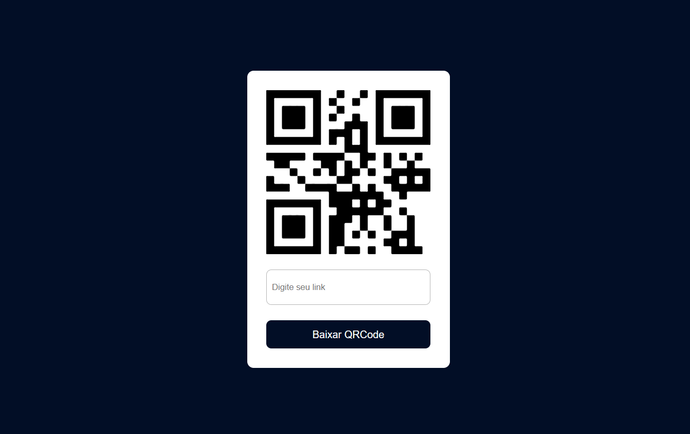

<h1 align="center">QRCode Generator</h1>

## Índice

- [Visão geral](#visão-geral)
  - [Screenshot](#screenshot)
  - [Links](#links)
- [Meu processo](#meu-processo)
  - [Tecnologias](#tecnologias)
  - [Recursos úteis](#recursos-úteis)
- [Requisitos](#requisitos)
  - [Rodando a aplicação](#rodando-a-aplicação)
- [Autor](#autor)


## Visão geral
QRCode Generator: com essa aplicação será possível gerar e baixar a imagem do QR Code

### Screenshot


### Links
- URL: [QRCode Generator](https://qrcode-generator-jordanferreiraa.vercel.app/)


## Meu processo

### Tecnologias
- [React](https://pt-br.reactjs.org/)
- [Vite](https://vitejs.dev/)
- [JavaScript](https://developer.mozilla.org/pt-BR/docs/Web/JavaScript)
- [HTML](https://developer.mozilla.org/pt-BR/docs/Web/HTML)
- [CSS](https://developer.mozilla.org/pt-BR/docs/Web/CSS)

###  Recursos úteis
- [ video do sujeito programador ](https://youtu.be/cFaihdXLy5A)
- [ website w3schools ](https://www.w3schools.com/)


## Requisitos

Para rodar na sua máquina, você vai precisar ter instalado as seguintes ferramentas: [Git](https://git-scm.com) e [Node](https://nodejs.org/en/).

### Rodando a aplicação

```bash
# Clone este repositório
$ git clone https://github.com/jordanferreiraa/qrcode-generator

# Acesse a pasta do projeto
$ cd qrcode-generator

# Instale as dependências
$ npm install

# Execute a aplicação em modo de desenvolvimento
$ npm run dev

# O servidor iniciará na porta:5173 <http://localhost:5173>
```

## Autor

- Linkedin - [ @jordan-ferreira-sousa ](https://www.linkedin.com/in/jordan-ferreira-sousa/)
- Instagram - [ @jordanferreirae ](https://www.instagram.com/jordanferreirae)

&#xa0;

<a href="#índice">Back to top</a>